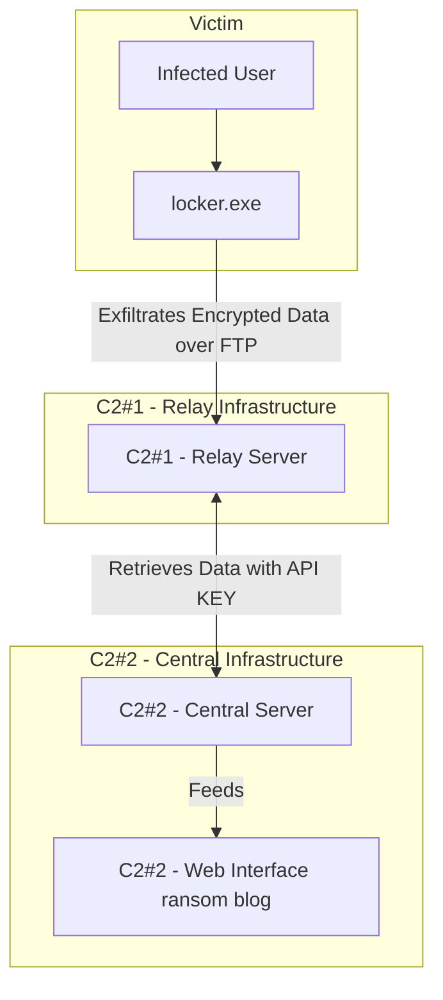
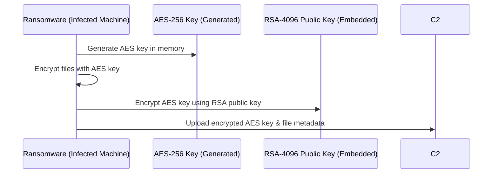

# Ransomware 

## 📌 Overview
This project simulates a ransomware operation, covering infection, encryption, exfiltration, and centralized control. It includes multiple components:

* **RustLock (Rust ransomware)**: The main ransomware payload, responsible for encrypting user data and exfiltrating it to the relay server over FTP.
* **Server/ClearService (C2 #1 - Relay Server)**: The first-hop server that temporarily stores the encrypted files in waiting to be downloaded for C2#2. The idea behind having a relay server is to be able to exfiltrate data over the clearnet (faster than TOR). It also allows to have a custom configuration like 0 logs or wipe systems in case of logins.
* **Server/HiddenService (C2 #2 - Central Server)**: The main TOR server scans multiple relay servers waiting for a new record, then downloads the data. It also serves a ransomware website via TOR.

```
ransomware/
├── README.md <--------------------- You are here :)!
│
├── RustLock/                       $ Ransomware Locker & Unlocker (Rust)
│   │                               # ====================================
│   ├── build.rs                     - Build script 
│   ├── compile.py                   - Compile script (recommended)
│   ├── .gitignore
│   ├── keys/                        - RSA Keys for locker and unlocker
│   ├── src/
│   │   ├── antireversing.rs         - Anti-debugging & obfuscation techniques
│   │   ├── config.rs                - Configurations
│   │   ├── lib.rs                   - Shared library
│   │   ├── locker.rs                - Locker entry point
│   │   ├── unlocker.rs              - Unlocker entry point
│   │   ├── cypher/                  - Encryption components for locker
│   │   └── decypher/                - Decryption components for unlocker
│   └── README.md                    - Documentation for RustLock module
│
└── server/                        Command & Control (C2) Servers
    │                               
    ├── ClearService/              $ Public C2 (C2 #1) - Relay server
    │   │                          # ====================================
    │   ├── Dockerfile              - Docker for quick deployment
    │   ├── api.py                  - API to serve encrypted data to C2#2
    │   ├── install.sh              - Installation script
    │   └── README.md               - Documentation for ClearService
    │
    └── HiddenService/             # Hidden C2 (C2 #2) - Central server
        │                          # ====================================
        ├── install.sh              - Installation script
        ├── backend/                - Backend (Flask/Django API for ransom blog)
        │   ├── api.py              - API that manages ransom operations
        │   └── README.md           - Backend documentation
        │
        ├── conf/                   - Configuration files
        │   ├── key.bin             - Private key for .onion service
        │   ├── torrc               - Tor service configuration (if applicable)
        │   └── etc...              - Other configuration files
        │
        ├── frontend/               - Ransom blog (React app)
        │   ├── src/                - React source code
        │   ├── public/             - Static assets
        │   ├── package.json        - Dependencies
        │   └── README.md           - Frontend documentation
        │
        └── README.md               - General documentation for HiddenService
```


# Exfiltration architecture

The ransomware follows this multi-stage attack pattern:




## 🔹 Step-by-step Execution Flow:

### 1. Infection (RustLocker)
* locker.exe is executed on the victim’s machine.
* It scans the filesystem and encrypts all relevant files using AES key that has been generated on execution time.
* It encrypts the Key with a public RSA then encode it in base64.
* It send the encrypted data and key to C2#1 over FTP

### 2. Exfiltration (C2#1)
* The victim encrypted data is sent to C2#1 (Relay Server) over FTP.
* C2#1 generates a unique entry for the data 
* This server has 0 log policy (not really implemented on the example)
* Implements a password to download the encrypted data about the victims

### 3. Ransom Blog Updates (C2#2)
* Periodically, the backend services ask for all the C2#1 (can be multiple) for encrypted data and keys.
* The victim’s data appears on the ransom blog (hosted by C2#2).
* This server now has the key (AES+RSA) encode in base64 that can use for unencrypt the data

# 🔐 Encryption Details
## The key cycle looks like

* **AES** the key is generated on execution. As its faster than RSA, it is used for encryption.
* **RSA** after encryption, AES key is encrypted with public RSA, so only the person who has the private key can recover the original key.

# 🛡️ Anti-Analysis & Evasion Techniques
To resist forensic analysis, RustLock implements basic methods like:

* **Environment Checks**: Detects sandboxes, virtual machines, and debuggers.
