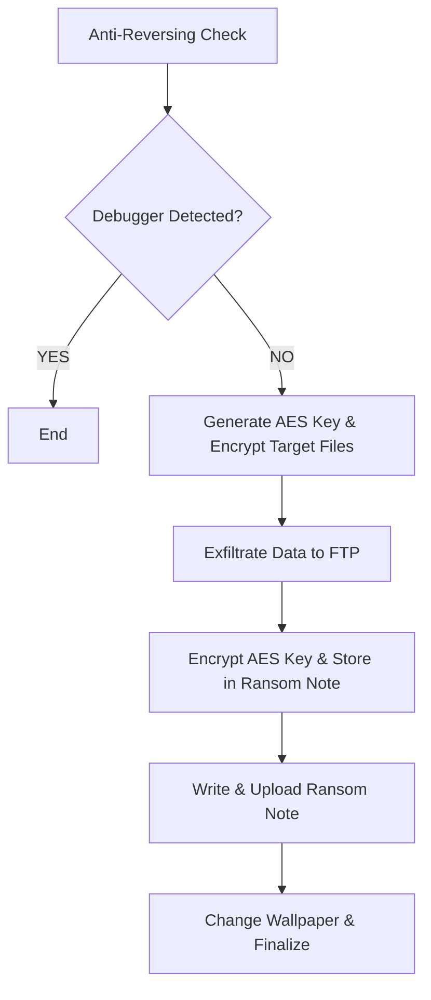

# 🦀 RustLock
A simple ransomware project for educational research on malware development. It uses RSA + AES for encryption, generating the AES key at runtime, encrypting important files, and then encrypting the AES key with RSA. It also uses FTP for data exfiltration.


> For more details, read [M3str3/ransomware/README.md](https://github.com/M3str3/ransomware/README.md).

## 🗂️ Key Files
- **`compile.py`** – Helper script for building in lock or unlock mode.
- **`build.rs`** – Handles build-time variables and key decryption.
- **`src/locker.rs`** – Main entry point for file encryption.
- **`src/unlocker.rs`** – Main entry point for file decryption.
- **`src/antireversing.rs`** – Implements basic anti-debugging measures.
- **`src/cypher/`** & **`src/decypher/`** – Handle encryption and decryption.
- **`keys/`** – Stores RSA public and private keys.

## ⚙️ Compilation
To compile the ransomware, it is recommended to use the provided **Python** script.

### 🔒 Compile the Locker
```sh
python compile.py locker
```
### 🔓 Compile the Unlocker
```sh
python compile.py unlocker
```
You must provide the AES+RSA+Base64 key generated at runtime.

## 🔄 Runtime Flow

