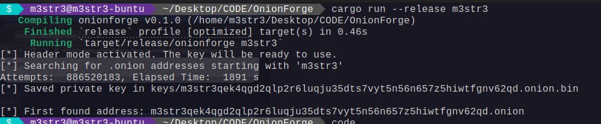

# Hidden Service (C2 #2)

This is the final part of my fictional ransomware, the ransom blog. The fist I did it was to create a custom onion url brute forcing the method, I used my own project [Onion Forge](https://github.com/M3str3/Onion-Forge) to do it. The key is saved as `key.bin` the key generated its for the onion url `m3str3qek4qgd2qlp2r6luqju35dts7vyt5n56n657z5hiwtfgnv62qd.onion`

An `install.sh` script is provided to deploy the server easily.

# !! IMPORTANT !!
This script is for educational purposes only. It is not intended to be used for malicious purposes.
